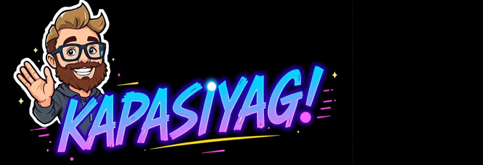

  

# Soyam Kapasiya | Backend Developer

  
  
  
  
  

## About Me

Welcome to my digital space! I'm a passionate backend developer with a knack for solving complex problems and crafting efficient solutions. With a strong foundation in Spring Boot, MongoDB, and a keen interest in building scalable architectures, I aim to create impactful systems that make a difference.

My journey involves diving deep into microservices, Elasticsearch, and backend optimization, while also exploring the intersections of Web Development and modern tools to bring ideas to life. I'm driven by the challenge of simplifying complexities and turning innovative ideas into tangible results.

## What I'm Up To

- 🔭 I'm currently working on **HRMS Dashboard**
- 🌱 I'm learning **Advanced Spring Boot, CSS/SCSS and JavaScript Fundamentals**
- 👯 I'm looking to collaborate on **Spring Boot** projects
- 👨‍💻 Portfolio: [soyamkapasiya.github.io/Portfolio](https://soyamkapasiya.github.io/Portfolio/#stats)
- 📝 I write articles on [Deepstash](https://deepstash.com/u/kapasiyag1)
- 💬 Ask me about **Java** and backend development
- 📫 Reach me at **Soyamp323@gmail.com**

## Coding Platforms

  
  
  

## Tech Stack

   
   
  

## GitHub Stats

  
  

  

---

  <i>Let's connect and build something amazing together!</i>

