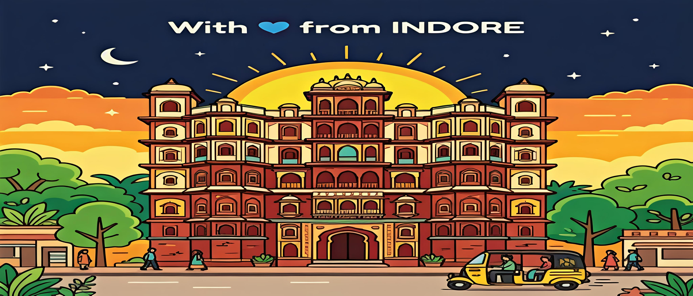

  

  

  

  
  
  
  

 

  

### 🌌 DATA_STREAM: BIOMETRICS
> "Engineering the backplane of tomorrow's intelligent systems."

I am a **High-Performance Backend Architect** with **2+ years** of recursive experience specializing in the **Java/AI overlap**. My core focus is on building **mission-critical microservices** and **deterministic AI pipelines** that bridge the gap between scale and intelligence.

- ⚡ **Specialties**: Distributed Workflows • RAG Architecture • Performance Tuning
- 🧠 **Method**: Clean Code • Design Patterns • Data-Driven Decisions
- 🌏 **Uplink**: Currently exploring global opportunities (Japan/International)

 

---

<h2 id="projects">📂 ARCHIVES: DEPLOYED SYSTEMS</h2>

<b> [ PROJECT_ALPHA ]: Shiphered AI</b>

 
<table border="0">
  <tr>
    <td width="70%">
      <b>Intelligent Support Automation Platform</b> 
      Built a high-volume monorepo application to automate support tickets using <code>FastAPI</code> and <code>RAG</code>. 
      Implemented fault-tolerant pipelines with <code>Temporal.io</code> and optimized AI accuracy using <code>pgvector</code>.
    </td>
    <td width="30%">
      <code>Python</code> • <code>FastAPI</code> 
      <code>RAG</code> • <code>Temporal</code> 
      <code>Pgvector</code> • <code>LLM</code>
    </td>
  </tr>
</table>

<b> [ PROJECT_BETA ]: OceanTrack Logistics</b>

 
<table border="0">
  <tr>
    <td width="70%">
      <b>Enterprise Logistics Core</b> 
      Developed critical REST modules for logistics workflows. Achieved 30% reduction in response latency through <code>Java Multithreading</code> and <code>Concurrency</code> optimization. Applied <code>Builder Patterns</code> for scalable object construction.
    </td>
    <td width="30%">
      <code>Java 11</code> • <code>Spring Boot</code> 
      <code>Hibernate</code> • <code>PSQL</code> 
      <code>Azure Blob</code> • <code>Swagger</code>
    </td>
  </tr>
</table>

<b> [ PROJECT_GAMMA ]: Claim-It Finance</b>

 
<table border="0">
  <tr>
    <td width="70%">
      <b>High-Compliance Financial Gateway</b> 
      Engineered distributed microservices for financial claim processing. Optimized large-scale data ingestion using <code>Snowflake</code> and <code>Oracle</code>. Ensured 99.9% reliability via automated <code>CI/CD</code> and clean-code principles.
    </td>
    <td width="30%">
      <code>Spring Boot</code> • <code>Microservices</code> 
      <code>Snowflake</code> • <code>Oracle</code> 
      <code>Jenkins</code> • <code>JPA</code>
    </td>
  </tr>
</table>

---

<h2 id="experience">💼 CHRONICLES: CAREER TIMELINE</h2>

  <table>
    <tr>
      <td width="15%"></td>
      <td width="85%">
        <b>Java Backend Developer @ Shiavnski Technologies</b> 
        <i>July 2024 – Present | Indore, India</i> 
        • Hardened production backends against critical high-load scenarios. 
        • Pioneered LLM-based internal tooling to boost dev cycle by 25%. 
        • Mastered complex RAG pipelines for Enterprise-grade AI support.
      </td>
    </tr>
  </table>

---

<h2 id="skills">🛠️ KERNEL: TECH_STACK</h2>

  

  
| LAYER | DISCIPLINE |
| :--- | :--- |
| **Logic** | `Java 8/11/17`, `Spring Boot`, `FastAPI`, `Microservices`, `Python` |
| **Persistence** | `PostgreSQL`, `MongoDB`, `Elasticsearch`, `Snowflake`, `Oracle`, `Redis` |
| **Automation** | `Temporal.io`, `Jenkins`, `Docker`, `GitLab CI`, `Bash` |
| **Intelligence** | `RAG`, `Langchain`, `Vector DBs`, `Prompt Engineering`, `LLM Integration` |

---

<h2 id="stats">📊 NEURAL_NET_ANALYTICS</h2>

<table border="0">
  <tr>
    <td></td>
    <td></td>
  </tr>
</table>
  
  

---

<h2 id="playground">🎮 SYSTEM_VOX: MINI_GAME</h2>

  
<b>CHALLENGE: MISSION_CONTROL_CRISIS</b>

  
Current Rank: <b>SYSTEM_NOVICE</b> | Objective: <b>Defeat the Rogue AI</b>

  
  
  

 

---

<h2 id="connect">🌐 UPLINK: SECURE_COMMUNICATIONS</h2>

  
  
  
  

  

<!-- Custom Indore Artwork (Rectangular Fix) -->

  

  

